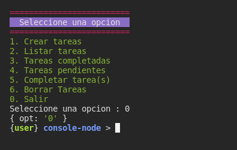
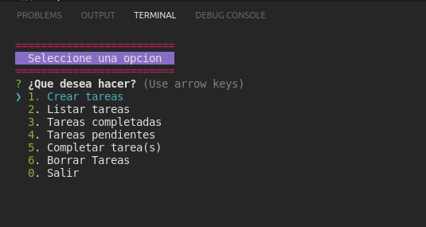
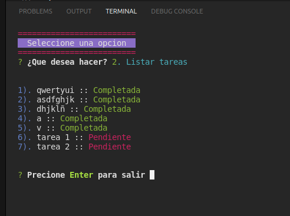
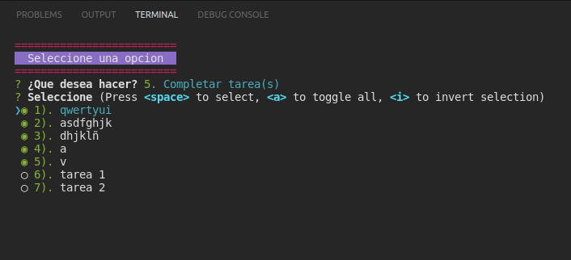

# Aplicacion consola con Nodejs


## Configuracion Manual del menu
Instalacion de dependencia para los colores

```shell
npm i colors
```

### Version para consola codigo manual


## Configuracion con libreria

Instalacion de la inquirer

```shell
npm i inquirer
```

### Version para consola libreria





